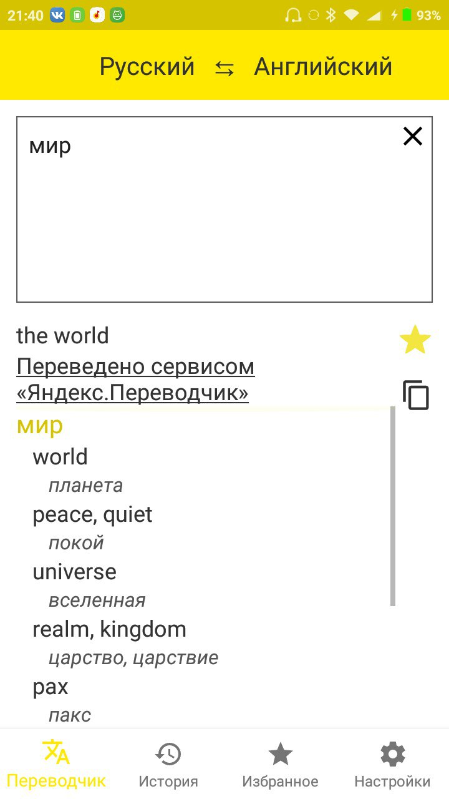
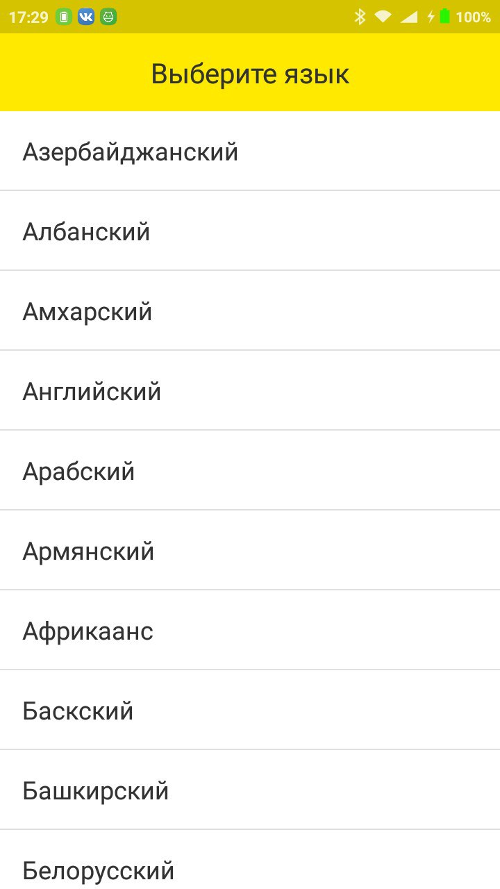
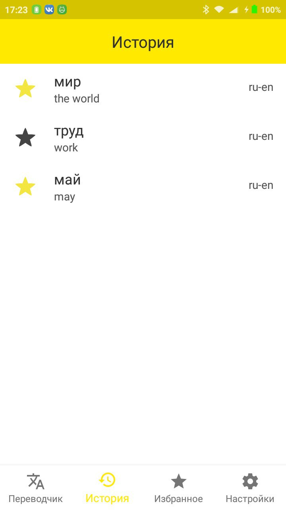
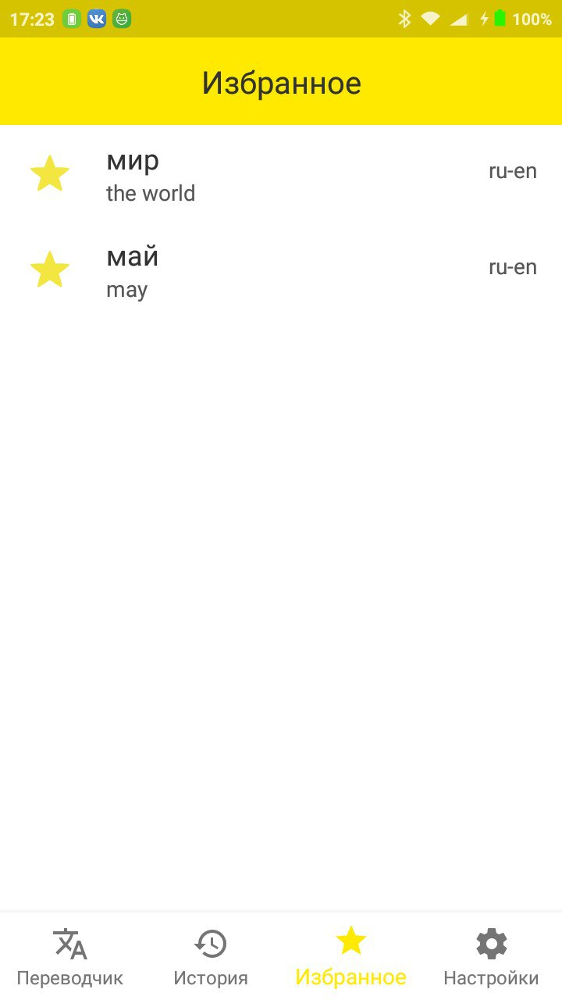
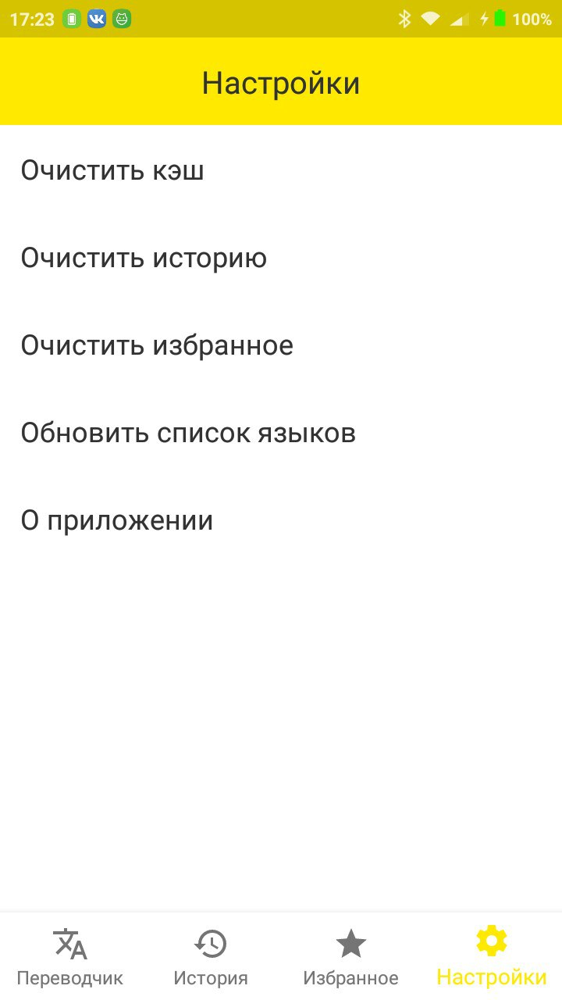
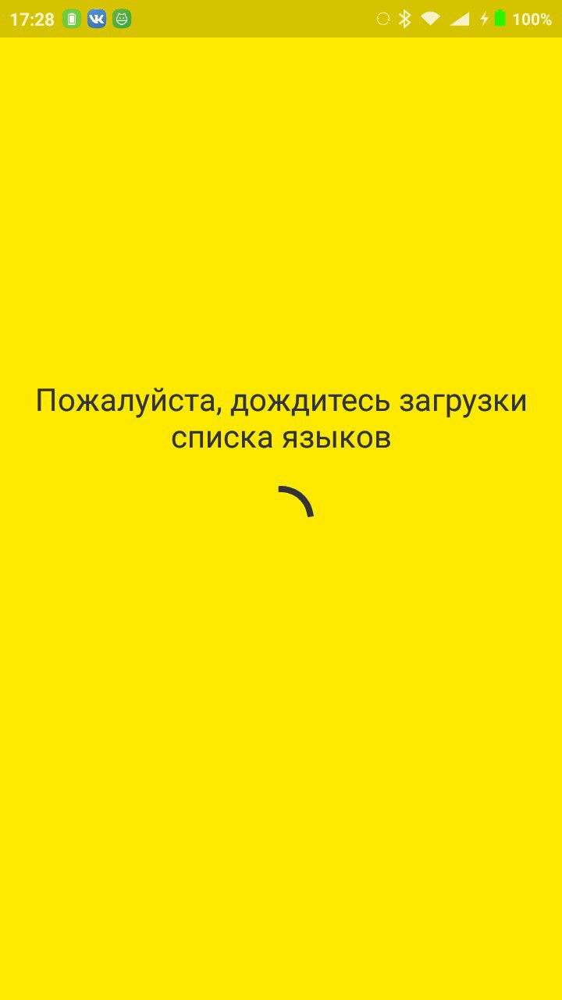
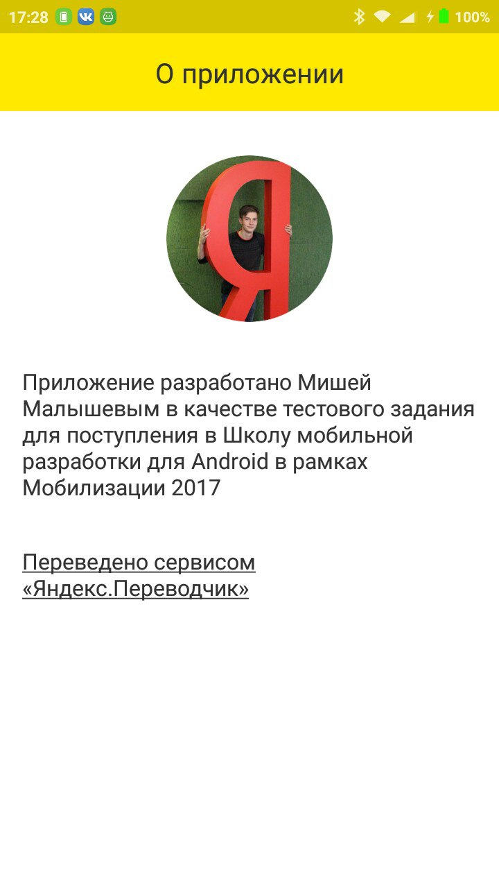

# Простой переводчик

### О приложении
Приложение разработано в качестве тестового задания 
для поступления в Школу мобильной разработки для Android в рамках 
[Мобилизации 2017](https://yandex.ru/mobilization/)

И, конечно же, [Переведено сервисом «Яндекс.Переводчик»](http://translate.yandex.ru/)

### Фукнционал
* Перевод текста с помощью [API Переводчика](https://tech.yandex.ru/translate/)
* Отображение вариантов перевода с помощью [API Словаря](https://tech.yandex.ru/dictionary)
* Сохранение переведённых текстов в истории
* Возможность добавить перевод в избранное
* Возможность обновить список языков
* Кэширование

### Скачать APK
[app-release.apk](app/app-release.apk)

### Известные баги
Все известные баги устранены. О наличии неизвестных сообщать сюда: [t.me/mlshv](https://t.me/mlshv)

### Скриншоты
      